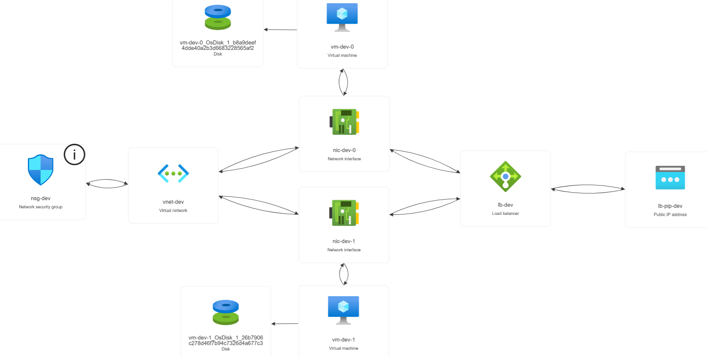
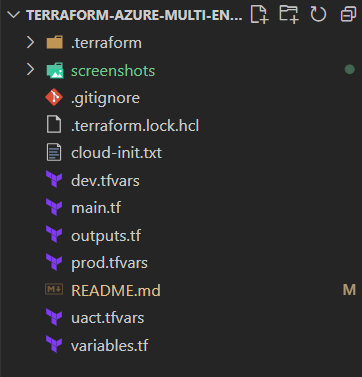
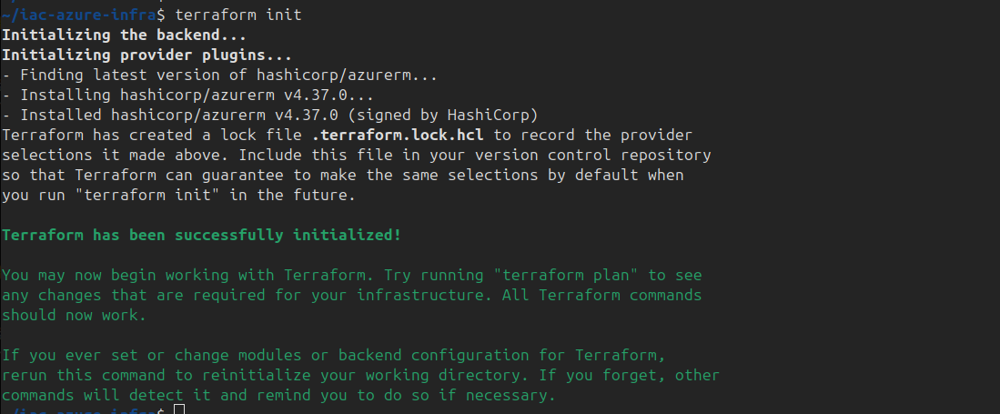
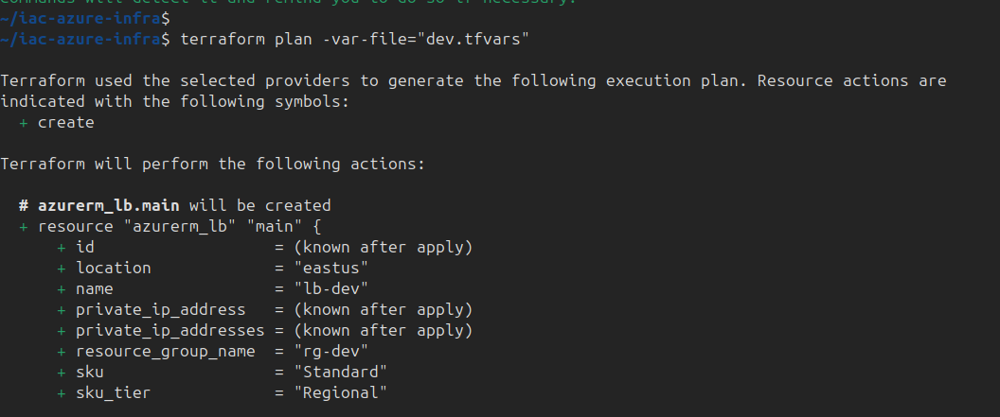
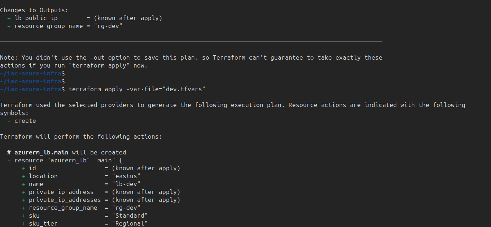
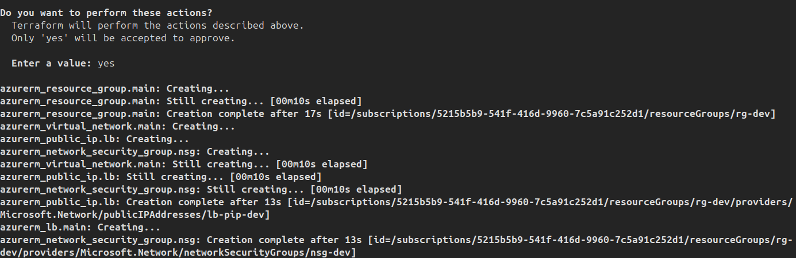
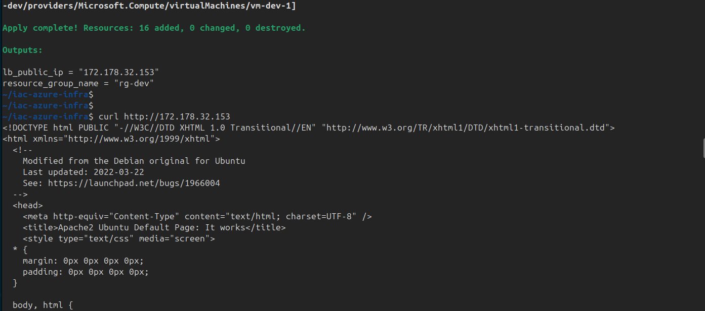
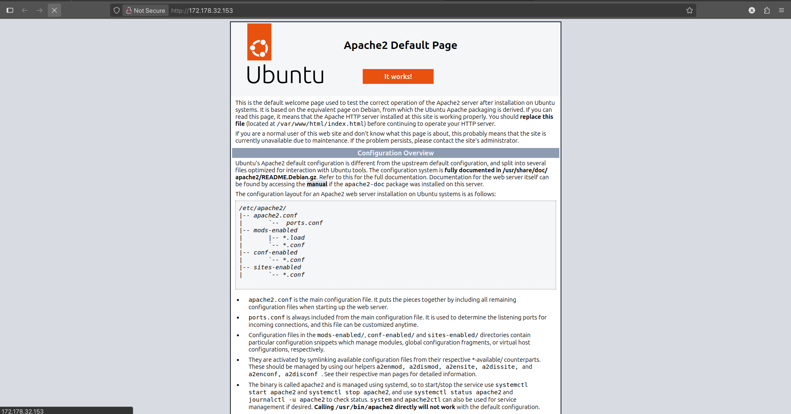
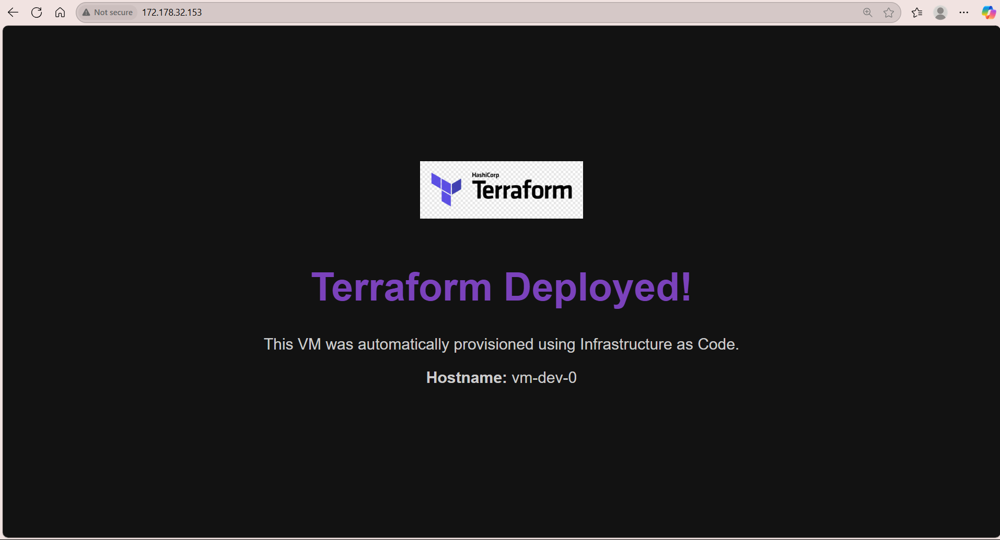

# Automated Web Hosting Solution with single click replication to Uact And Prod Environmet

This project uses **Terraform** to deploy a load-balanced web server setup on **Microsoft Azure**. It provisions:   
- A Virtual Network with a Subnet   
- A Network Security Group with HTTP and SSH rules   
- Two Ubuntu Virtual Machines with Apache installed via cloud-init   
- A Standard SKU Load Balancer with Health Probes and Rules    

---

### Architecture Diagram   
  

---

### Project Structure


---

### Prerequisites
- Azure subscription with at least **4 vCPU quota**
- Terraform CLI v1.5 or higher
- Azure CLI (logged in via `az login`)

---


### Setup Instructions

1. Clone the repo:
   ```bash
   git clone https://github.com/ayush03ch/Terraform-Azure-Multi-Env-WebInfra.git
   cd azure-terraform-loadbalancer
    ````

2. Initialize Terraform:
   ```bash
   terraform init
    ````

3. Preview infrastructure changes:
   ```bash
   terraform plan -var-file="dev.tfvars"
   ````

4. Apply the configuration:
    ```bash
   terraform apply -var-file="dev.tfvars"
   ````

5. Output the public IP of the load balancer:
   ```bash
   terraform output
   ````

6. Open the browser and access:
   ```
   http://<LoadBalancer_Public_IP>
   ```
>NOTE: similarly for uact and prod environments, replace 'dev' with 'uact' or 'prod' in above steps
---


### Cleanup Resources
```bash
terraform destroy -var-file="dev.tfvars"
````

---


### Screenshots






> If you host a custom web page on the vm, paste the entire content of custom-Web-Page.txt in cloud-init.txt, or create your own web page



---


### References
- [Terraform Azure Provider Docs](https://registry.terraform.io/providers/hashicorp/azurerm/latest/docs)
- [Terraform Configuration Language (HCL) basics](https://developer.hashicorp.com/terraform/language)
- [Terraform Input Variables (variables.tf) guide](https://developer.hashicorp.com/terraform/language/values/variables)
- [Apache Setup via cloud-init for Azure Linux VM ](https://github.com/ricmmartins/linuxvm-cloud-init?utm_source=chatgpt.com)
